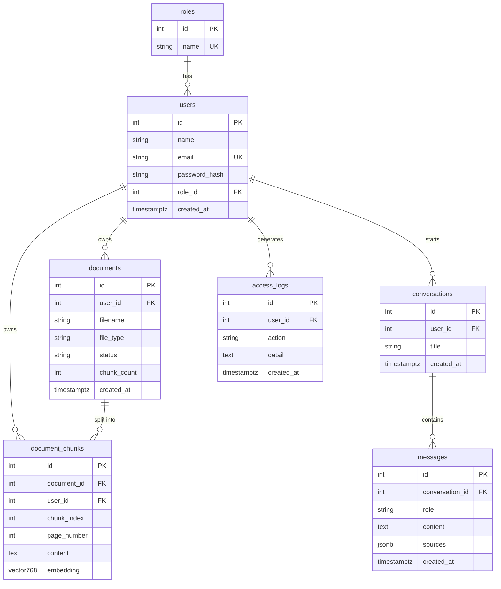

# ER Diagram

SVG version: `er_diagram.svg`. Mermaid version below (renders on GitHub / VS Code Mermaid preview).

```mermaid
erDiagram
    roles ||--o{ users : "has"
    users ||--o{ documents : "owns"
    users ||--o{ document_chunks : "owns"
    documents ||--o{ document_chunks : "split into"
    users ||--o{ conversations : "starts"
    conversations ||--o{ messages : "contains"
    users ||--o{ access_logs : "generates"

    roles { int id PK
            string name UK }
    users { int id PK
            string name
            string email UK
            string password_hash
            int role_id FK
            timestamptz created_at }
    documents { int id PK
                int user_id FK
                string filename
                string file_type
                string status
                int chunk_count
                timestamptz created_at }
    document_chunks { int id PK
                      int document_id FK
                      int user_id FK
                      int chunk_index
                      int page_number
                      text content
                      vector768 embedding }
    conversations { int id PK
                    int user_id FK
                    string title
                    timestamptz created_at }
    messages { int id PK
               int conversation_id FK
               string role
               text content
               jsonb sources
               timestamptz created_at }
    access_logs { int id PK
                  int user_id FK
                  string action
                  text detail
                  timestamptz created_at }
```
